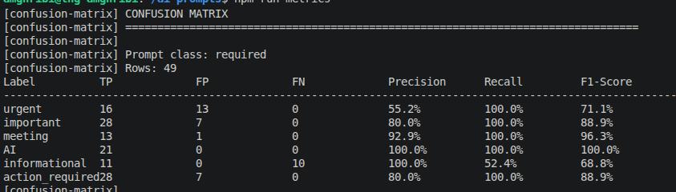
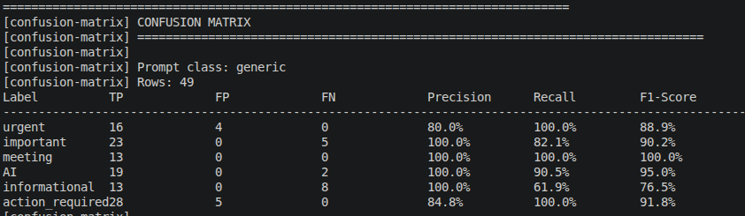
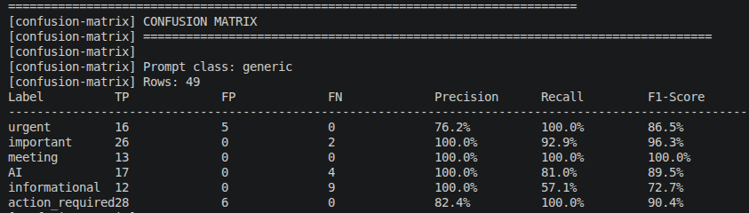
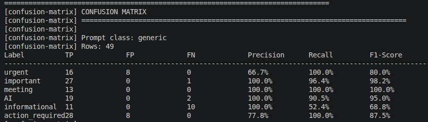

## Email Classification Datasets

### Overview
We use two datasets for evaluating email classification prompts:

- **Small Dataset**: Designed for quick tests and rapid iterations.
- **Large Dataset**: Intended for more comprehensive and accurate evaluations.

### Goal
The main objective is to **test different prompt designs** and **compare their performance** using evaluation metrics such as the **confusion matrix**.

Although the current direction is to move away from using the **`action_required`** (or **needs action**) field as a separate output, it remains valuable to keep it for **benchmarking and comparison** with existing prompts.

---

## Existing Prompts

### 1. Prompt with `action_required`
- This prompt first determines whether the email requires an action.
- The LLM responds with **"YES"** or **"NO"** in the `action_required` field.
- It then assigns the appropriate **labels** to the email.

### 2. Prompt with Generic Labels Only
- This prompt returns **only labels**, without a dedicated `action_required` field.
- In this setup, **`action_required` is treated as a label**.

---

## Approaches for Handling `action_required`

### Approach 1: Treating `action_required` as a Standard Label
All labels are handled uniformly, and the requirement for action is defined within the label’s description.

```javascript
{ 
  id: 'action_required', 
  description: 'Apply ONLY if the email contains a clear and direct request requiring a specific action from the recipient (e.g., reply, provide information, approve, complete a task, or explicitly respond). The request must be addressed to the recipient and create a clear obligation to act. Do NOT apply to newsletters, marketing emails, automated messages (no-reply, notifications, alerts), meeting invitations without a required response, or purely informational content. Do NOT apply if the action is optional, implicit, or unclear. Most emails do NOT require action.'
} 
```
### Approach 2: Explicit `action_required` Field in the Prompt

In this approach, the requirement for action is explicitly specified in the prompt rather than being treated as a label.

Two prompt versions are used:
- **Long version**: Provides detailed instructions.
- **Short version**: More concise, allowing performance comparison.

#### Advantages
- Clear separation between action detection and label classification.
- Easier interpretation for downstream workflows.

---

###  Testing Requirements

Since two datasets are available, the dataset used during evaluation must be specified when running the evaluation command.

#### Using npm Scripts

**Large dataset (default):**
```bash
npm run eval:email
npm run eval:email:large
```

**Large dataset (default):**

```bash
npm run eval:email
npm run eval:email:small
```

#### Using an Environment Variable
You can also explicitly specify the dataset by setting the EMAIL_DATASET environment variable:


```bash
EMAIL_DATASET=small npm run eval:email
EMAIL_DATASET=large npm run eval:email
```
## Results

The evaluation results compare the performance of different email classification prompt strategies using confusion matrices. Each matrix illustrates how accurately the model predicts the action_required`behavior and associated labels.

### 1. Prompt with Explicit `action_required` Field
This prompt explicitly asks the LLM to determine whether an email requires action by returning YES or NO, followed by the relevant labels.

- **Objective:** Separate action detection from label classification.



---

### 2. Generic Labels Only

In this configuration, the action_required concept is treated as a label rather than a separate field. Several prompt variations were evaluated to measure the impact of instruction clarity.

#### 2.1 Generic Prompt with Detailed Description in the action_required Label
- **Description:** The requirement for action is defined within the label’s description.



#### 2.2 Generic Prompt without Detailed Description (V1)
- **Description:** A minimal version of the prompt with limited guidance regarding the `action_required` label.


#### 2.3 Generic Prompt with `action_required` Behavior Described in the Prompt (V2)
- **Description:** The behavior associated with `action_required` is explained directly in the prompt rather than in the label description.



#### 2.4 Generic Prompt with Enhanced Behavior Description (V3)
- **Description:** An extended version of V2 with more explicit and refined instructions regarding when an action is required.

